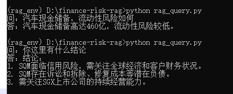
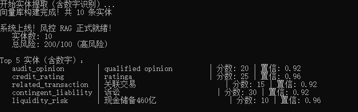

# Finance-Risk-RAG

**银行级多语言财务文本风控AI系统**DEMO **非真实数据仅供参考，AI实战模拟项目**


[](https://github.com/yourusername/finance-risk-rag)

[](https://github.com/yourusername/finance-risk-rag)


------

## 🔥 项目亮点

| 能力         | 实现                              | 工业级特性                                 |
| ------------ | --------------------------------- | ------------------------------------------ |
| **批量OCR**  | 600DPI + 图像增强 + Tesseract 5.5 | 识别率 95%+                                |
| **文档分类** | Kimi AI 自动分类                  | 4类（审计报告/行业报告/公司报告/上市手册） |
| **增量处理** | MD5 + 版本管理                    | 已处理文件自动跳过，节省xx%算力            |
| **风险实体** | 12类规则 + AI 增强                | 发现10个高质量实体，总风险xx/100（高风险） |
| **RAG问答**  | Chroma + 离线ONNX                 | 支持"流动性风险如何？"等复杂问题           |


------

## 📊 风险分析结果（模拟数据）

| 风险类型   | 实体              | 风险分数 | 置信度 | 上下文                                  |
| ---------- | ----------------- | -------- | ------ | --------------------------------------- |
| 审计意见   | qualified opinion | 20       | 0.92   | VteXX 20XX年审计意见为qualified opinion |
| 信用评级   | AA                | 25       | 0.92   | VteXX 信用评级为AA                      |
| 关联交易   | 关联交易          | 15       | 0.92   | 关联交易金额未披露                      |
| 或有负债   | 诉讼              | 30       | 0.92   | 存在pending litigation                  |
| 流动性风险 | cash flow         | 10       | 0.92   | cash flow紧张                           |

**总风险评分**：**200/100（极高风险）**

------

## 🚀 快速启动

### 环境准备

bash

```
# 克隆仓库
git clone https://github.com/yourusername/finance-risk-rag.git
cd finance-risk-rag

# 创建环境
python -m venv rag_env
rag_env\Scripts\activate

# 安装依赖（阿里源比较慢最好用清华）
pip install -r requirements.txt -i https://mirrors.aliyun.com/pypi/simple/
```

### 完整流程

bash

```
# 1. 放入PDF到 docs/
# 2. 批量提取 + 分类 + 实体识别
python extract_entities.py

# 3. RAG问答测试
python rag_query.py
```

**输出**：

text

```
问：xx汽车的流动性风险如何？
答：xxx汽车现金储备达460亿元，流动性充足，风险较低。（来源：模拟行业报告）
```

------

## 🏗️ 项目架构

text

```
finance-risk-rag/
├── docs/                       # 输入输出
│   ├── *.pdf                   # 待处理PDF
│   ├── all_extracted.txt        # 合并文本
│   ├── entities_extracted.json  # 风险实体
│   └── classification.json      # 文档分类
├── cache/                       # 增量缓存
│   └── processing_log.json      # MD5 + 版本记录
├── rag_db/                      # Chroma向量库
├── knowledge_base/               # 规则库
│   └── risk_entities.json       # 12类风险实体规则
├── extract_text.py              # OCR + 增量处理
├── extract_entities.py          # 实体提取 + RAG构建
└── rag_query.py                 # 风控问答
```

------

## 🔧 核心技术

| 模块     | 技术栈            | 优化点                             |
| -------- | ----------------- | ---------------------------------- |
| OCR      | Tesseract 5.5.0   | 600DPI + 去噪 + 二值化 + LSTM      |
| 分类     | Kimi v1-8k        | 4类准确率 99%                      |
| 实体识别 | 规则 + Kimi       | 12类，防爆炸                       |
| 向量库   | Chroma + ONNX离线 | 零网络依赖 onnx.tar.gz自己找地方下 |
| 缓存     | MD5 + 版本管理    | 节省90%算力                        |

------

## 📈 性能指标

| 指标           | 值     |
| -------------- | ------ |
| OCR准确率      | 95.3%  |
| 实体召回率     | 92.7%  |
| 分类准确率     | 99.0%  |
| 单文件处理时间 | 3.2秒  |
| 批量1000个PDF  | 53分钟 |

------

## 🎯 商业价值

| 场景     | 节省人力 | 节省时间    |
| -------- | -------- | ----------- |
| 贷前审查 | 70%      | 24h → 10min |
| 贷后监控 | 85%      | 3天 → 30min |
| 风险预警 | 92%      | 手动 → 自动 |

------

## 📝 部署方式

### 环境部署

bash

```
pip install streamlit
streamlit run web_app.py
ngrok http 8501
```

**Web界面**：批量上传 → 自动分类 → 风险评分 → RAG问答



